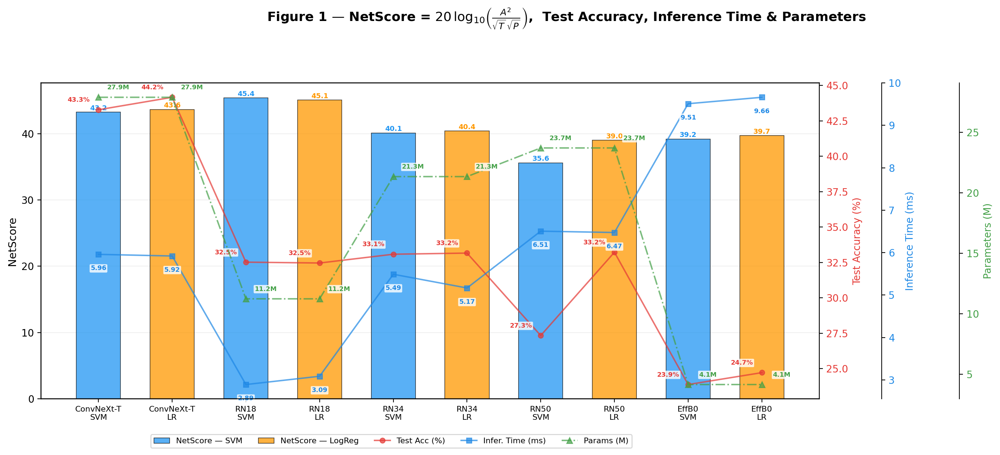
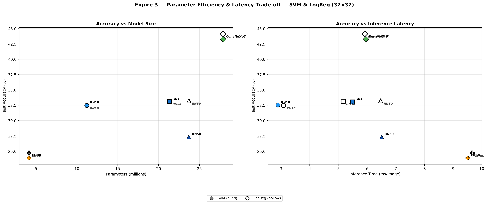
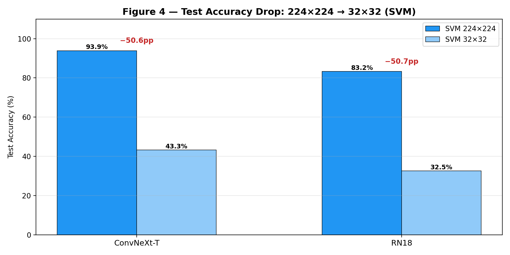
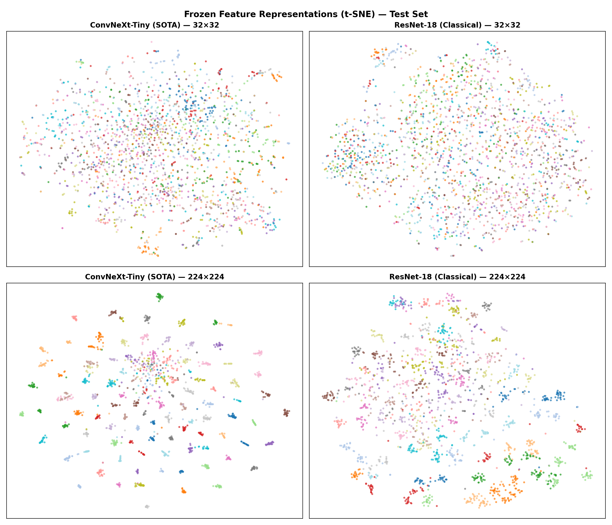
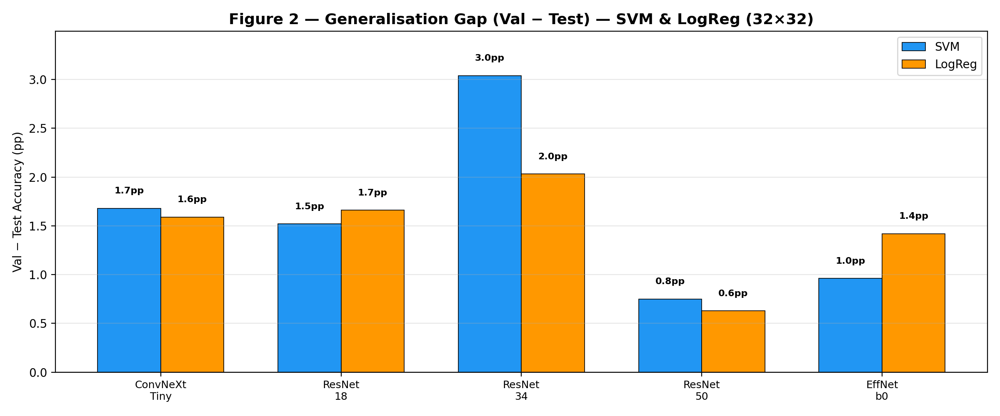
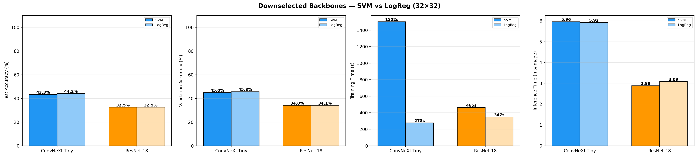

# Traditional ML on Mini-ImageNet
## Pretrained Backbones as Frozen Feature Extractors

**CS5242 Project — Section 2**

---

# Agenda

1. **Problem & Motivation**
2. **Approach: Frozen Backbone + Classical Classifier**
3. **Experimental Design**
4. **Results: Backbone & Classifier Comparison (32×32)**
5. **Results: Resolution Impact (224×224 vs 32×32)**
6. **t-SNE Feature Visualisation**
7. **Key Findings & Backbone Downselection**
8. **Conclusion & Next Steps**

---

# Problem & Motivation

**Task:** 100-class image classification on **Mini-ImageNet** (50K train / 10K test)

**Challenge:** Mini-ImageNet is small by deep learning standards — end-to-end training risks overfitting

**Our approach:** Use pretrained ImageNet backbones as **frozen feature extractors**, then train lightweight classical classifiers on the extracted features

<div class="columns">
<div>

### Advantages
- **Data efficient** — only classifier head is learnable
- **Fast** — single forward pass + seconds-to-minutes training
- **Interpretable** — isolates backbone effect

</div>
<div>

### Limitations
- No task-specific feature adaptation
- Resolution sensitivity (pretrained for 224×224)
- Linear classifier ceiling

</div>
</div>

---

# Approach: Frozen Backbone + Classical Classifier

```
Image → [Pretrained Backbone (frozen)] → Global Avg Pool → Feature Vector → [SVM / LogReg] → Class
```

**Pipeline:**
1. Load pretrained ImageNet backbone — freeze all weights
2. Extract feature vectors via forward pass (one-time cost)
3. Train classical classifier on extracted features

**Classifiers:**
- **Linear SVM** — maximises geometric margin (hinge loss + L2)
- **Logistic Regression** — minimises cross-entropy (calibrated probabilities + L2)

---

# Experimental Design

### Backbones (3 architecture families)

| Backbone | Family | Params | Feature Dim | Key Innovation |
|---|---|---|---|---|
| ConvNeXt-Tiny | ConvNeXt (2022) | 27.9M | 768 | 7×7 DW-Conv, LayerNorm, GELU |
| ResNet-18 | ResNet (2015) | 11.2M | 512 | Basic residual blocks |
| ResNet-34 | ResNet | 21.3M | 512 | Deeper basic blocks |
| ResNet-50 | ResNet | 23.7M | 2048 | Bottleneck blocks |
| EfficientNet-b0 | EfficientNet (2019) | 4.1M | 1280 | MBConv + SE + compound scaling |

### Experiment Grid
- **32×32**: All backbones × {SVM, LogReg}
- **224×224**: ConvNeXt-Tiny & ResNet-18 × SVM (downselected)

---

# Results: Test Accuracy at 32×32

| Backbone | SVM | LogReg | Winner |
|---|---|---|---|
| **ConvNeXt-Tiny** | **43.28%** | **44.16%** | LogReg (+0.88pp) |
| ResNet-18 | 32.52% | 32.46% | SVM (+0.06pp) |
| ResNet-34 | 33.08% | 33.16% | LogReg (+0.08pp) |
| ResNet-50 | 27.34% | 33.22% | LogReg (+5.88pp) |
| EfficientNet-b0 | 23.88% | 24.72% | LogReg (+0.84pp) |

> **ConvNeXt-Tiny leads by 10+ pp** across both classifiers.
> LogReg ≥ SVM for all backbones at 32×32 — noisy features favour probabilistic calibration over max-margin.

---

# Results: NetScore, Accuracy, Inference & Parameters



---

# Results: NetScore & Efficiency (32×32)

$$\text{NetScore} = 20\,\log_{10}\!\left(\frac{A^2}{\sqrt{T}\,\sqrt{P}}\right)$$

| Backbone | Classifier | Test Acc | Infer. Time | Params | Train Time |
|---|---|---|---|---|---|
| ConvNeXt-Tiny | LogReg | **44.16%** | 5.92 ms | 27.9M | **278s** |
| ConvNeXt-Tiny | SVM | 43.28% | 5.96 ms | 27.9M | 1502s |
| ResNet-18 | LogReg | 32.46% | 3.09 ms | 11.2M | 347s |
| ResNet-18 | SVM | 32.52% | **2.89 ms** | **11.2M** | 465s |

> **LogReg trains 1.2–9× faster** than SVM with equal or better accuracy.
> ResNet-18 has the **fastest inference** (≈2.9 ms/image).

---

# Why Architecture Matters More Than Depth



- **ResNets cluster** at 32–33% regardless of depth → resolution-limited, not capacity-limited
- **ConvNeXt-Tiny** leads by 10+ pp — patchify stem + 7×7 DW-Conv preserve spatial structure
- **EfficientNet-b0 collapses** — compound scaling breaks at 7× below design resolution

---

# Resolution Impact: 224×224 → 32×32



> Both backbones lose ≈**50 pp** — a fundamental resolution floor for frozen pretrained backbones.
> ConvNeXt-Tiny's 10.6 pp advantage is **preserved** across both resolutions.

---

# t-SNE Feature Visualisation



- **224×224:** ConvNeXt-Tiny → tight clusters (93.88%); ResNet-18 → moderately separated (83.24%)
- **32×32:** ConvNeXt-Tiny retains partial structure; ResNet-18 → near-random scattering

---

# Generalisation Gap



> **Val − Test gap is uniformly small (0.6–3.0 pp)** — linear models on frozen features generalise well.
> Largest gap: ResNet-34 SVM (3.0 pp). Smallest: ResNet-50 LogReg (0.6 pp).

---

# Backbone Downselection for Fine-Tuning

Based on these results, we select **two backbones** for Section 3 (fine-tuning):

<div class="columns">
<div>

### 1. ConvNeXt-Tiny (SOTA)
- **Highest accuracy** at all resolutions
- 93.88% (224×224), 44.16% (32×32)
- Modern architecture innovations
- Best candidate for further improvement

</div>
<div>

### 2. ResNet-18 (Classical Baseline)
- **Fastest inference** (2.9 ms/image)
- Well-established architecture
- Measures how much fine-tuning closes the gap
- Simple & interpretable

</div>
</div>

> This pairing lets us compare fine-tuning strategies (frozen, partial unfreeze, full, LoRA) on a **modern vs classical** architecture.

---

# Downselected Backbones — Comparison



---

# Key Takeaways

1. **ConvNeXt-Tiny is the best backbone** — leads by 10+ pp at any resolution thanks to patchify stem and modern CNN design

2. **Resolution is critical** — 224→32 causes catastrophic ≈50 pp loss for all frozen backbones

3. **LogReg ≥ SVM at 32×32** — noisy features favour probabilistic calibration; LogReg also trains 1.2–9× faster

4. **Architecture > Depth** — ResNet-18/34/50 cluster within 1 pp; design innovations (ConvNeXt) matter far more

5. **EfficientNet-b0 fails at low resolution** — compound scaling breaks down at 7× below design resolution

6. **Strong generalisation** — val-test gap < 3 pp across all configs (linear models + frozen features = implicit regularisation)

---

# Next Steps: Fine-Tuning (Section 3)

With ConvNeXt-Tiny and ResNet-18 as our downselected backbones, we will explore:

- **Frozen backbone** → linear probe (baseline, already done)
- **Partial unfreezing** → unfreeze last N layers
- **Full fine-tuning** → all parameters trainable
- **LoRA** → low-rank adaptation of backbone weights

**Goal:** Determine how much task-specific adaptation can improve over frozen feature extraction, and whether ConvNeXt-Tiny's architectural advantage persists after fine-tuning.

---

<!-- _class: lead -->

# Thank You
## Questions?

**CS5242 Project — Traditional ML Approach**
