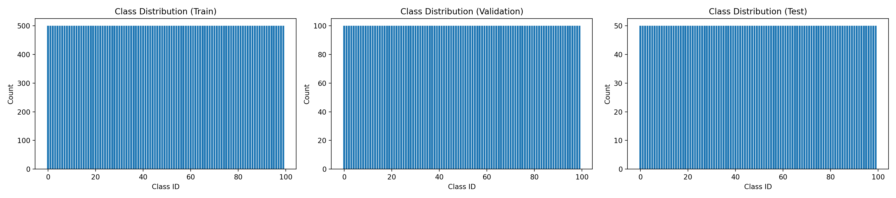

<!-- _class: lead -->

# CS5242 Project
## Image Classification on Mini-ImageNet

**Frozen Features, Fine-Tuning, and From Scratch — a Three-Lens Comparison**

---

# Agenda

1. **Problem, Data & Pre-processing** — Mini-ImageNet, EDA, normalisation choices
2. **Three Approaches** — baseline + proposed improvement
3. **Approach 1** — Classical ML on frozen pretrained features
4. **Approach 2** — Fine-tuning with selective unfreezing
5. **Approach 3** — Training from scratch
6. **Conclusions** — cross-approach synthesis

---

<!-- _class: lead -->

# Part 1
## Problem, Data & Pre-processing

---

<!-- _class: "" -->
<style scoped>
section { font-size: 20px; }
h1 { font-size: 30px; }
</style>

# Problem Statement & Motivation

**Task.** 100-class image classification on **Mini-ImageNet** — small enough to iterate on a single GPU yet rich enough to distinguish modern architectures.

**Why this problem?** Canonical CV task where trade-offs between **architecture**, **data regime**, and **pretraining** can be measured cleanly. Mini-ImageNet stresses **small data** (500/class), **low resolution** (32×32), and the **pretrained-vs-scratch** divide.

**Why deep learning?** 100-way image classification needs hierarchical visual features — CNN/ConvNeXt inductive biases match the input structure; no competitive classical alternative at this scale.

**Why pretrained models — justified.** We use them in **A1 & A2** to quantify how much Mini-ImageNet performance is carried by ImageNet pretraining, and include **A3 (from scratch)** to isolate that contribution. The scientific question is *the value of pretraining*.

---

<!-- _class: "" -->
<style scoped>
section { font-size: 20px; }
h1 { font-size: 30px; }
h3 { font-size: 22px; }
</style>

# Dataset

- **Source:** Mini-ImageNet [4] — 100 classes drawn from ImageNet-1K
- **Splits:** 50,000 train / 10,000 val / 5,000 test (fixed, reproducible)
- **Balance:** 500 train images per class (perfectly balanced — no re-weighting needed)
- **Resolutions tested:** native (≈500×N) resized to **224×224** and **32×32**

<div class="columns">
<div>

### Why 32×32 *and* 224×224?
- **224×224** matches pretraining → upper-bound on pretrained feature quality
- **32×32** stresses architectures *off* design regime — robustness test + practical memory-bandwidth setting

</div>
<div>

### Known Caveat
Mini-ImageNet's 100 classes are a *subset* of ImageNet-1K. Pretrained backbones have seen these classes, so 224×224 pretrained numbers are an **upper bound**, not transfer to an unseen distribution. Approach 3 (from scratch) addresses this directly.

</div>
</div>

---

<!-- _class: "" -->
<style scoped>
section { font-size: 20px; }
h1 { font-size: 30px; }
h3 { font-size: 22px; }
</style>

# Exploratory Data Analysis

<div class="columns">
<div>



### Class distribution
- Exactly balanced across train/val/test — no class imbalance to correct
- Eliminates class-weighting as a confound in later results

### Dataset statistics
- **Train mean (RGB):** `(0.479, 0.452, 0.408)`
- **Train std (RGB):** `(0.288, 0.280, 0.294)`
- Native resolutions cluster near 500×375

</div>
<div>

### Visual sample (random grid)


</div>
</div>

> EDA outputs in [experiments/eda/](../eda/) — full figures from `data_analysis.ipynb`.

---

<!-- _class: "" -->
<style scoped>
section { font-size: 20px; }
h1 { font-size: 30px; }
h3 { font-size: 22px; }
blockquote { font-size: 18px; }
</style>

# Pre-processing Pipeline

<div class="columns">
<div>

### Shared across all approaches
- **Resize** to target (224 or 32) with aspect-preserving centre crop
- **Normalise** with this dataset's own mean/std (from the train split), not ImageNet defaults
- **Channel order** RGB, tensor in `[0,1]` before normalisation
- Split integrity: transforms fit on **train only**; val/test use those stats

</div>
<div>

### Approach-specific
- **A2 & A3 (training):** random crop + horizontal flip augmentation
- **A1 (frozen features):** no train-time augmentation — features extracted once and cached
- **A3 (from scratch):** heavier augmentation may be used — *[team member to specify]*

</div>
</div>

> Computing mean/std *on this dataset* is deliberate: the 32×32 resized distribution's statistics drift from full-resolution ImageNet statistics.

---

<!-- _class: lead -->

# Part 2
## Three Approaches — Baseline & Improvement

---

# The Three-Lens Design

<div class="columns-3">
<div>

### Approach 1 — Classical ML
**Role:** strong baseline using **pretrained** features
- Frozen backbone + linear SVM / LogReg
- Isolates feature quality from classifier choice
- Very cheap, interpretable

</div>
<div>

### Approach 2 — Fine-Tuning
**Role:** **proposed improvement**
- Pretrained init + selective unfreezing
- Combines transfer with task-specific adaptation
- Expected Pareto-best at moderate cost

</div>
<div>

### Approach 3 — Scratch
**Role:** baseline from **first principles**
- Random init, full training
- Same architecture family, no ImageNet prior
- Measures *pure* in-domain signal

</div>
</div>

> **Scientific question:** how much of Mini-ImageNet performance is *feature quality from pretraining* (A1) vs *task-specific adaptation* (A2) vs *learned end-to-end without prior* (A3)?
> Reporting all three lets us attribute performance to each source instead of conflating them.

---

<!-- _class: lead -->

# Part 3
## Approach 1 — Classical ML
### Pretrained Backbones as Frozen Feature Extractors
### <span style="color:#555">(Strong baseline using pretrained features)</span>

---

<!-- _class: "" -->
<style scoped>
section { font-size: 20px; }
h1 { font-size: 30px; }
h3 { font-size: 22px; }
blockquote { font-size: 18px; }
</style>

# Approach 1: Motivation

**Idea:** Use pretrained ImageNet backbones as **frozen feature extractors**, then train lightweight classical classifiers on the extracted features.

<div class="columns">
<div>

### Advantages
- **Data efficient** — only classifier head is learnable
- **Fast** — single forward pass + seconds-to-minutes training
- **Interpretable** — isolates backbone effect

</div>
<div>

### Limitations
- No task-specific feature adaptation
- Resolution sensitivity (pretrained for 224×224)
- Linear classifier ceiling

</div>
</div>

---

# Approach 1: Pipeline

```
Image → [Pretrained Backbone (frozen)] → Global Avg Pool → Feature Vector → [SVM / LogReg] → Class
```

**Pipeline:**
1. Load pretrained ImageNet backbone — freeze all weights
2. Extract feature vectors via forward pass (one-time cost)
3. Train classical classifier on extracted features

**Classifiers (sklearn, default hyperparameters):**
- **Linear SVM** — `LinearSVC`, **squared-hinge** loss + L2, OvR, liblinear coordinate-descent solver
- **Logistic Regression** — multinomial cross-entropy + L2, LBFGS, `max_iter=2000`

> Results are single-seed with default hyperparameters.

---

<!-- _class: "" -->
<style scoped>
section { font-size: 18px; }
h1 { font-size: 28px; }
h3 { font-size: 20px; }
table { font-size: 15px; }
blockquote { font-size: 15px; }
</style>

# Approach 1: Experimental Design

### Backbones (3 architecture families)

| Backbone | Family | Params (backbone, M) | Feature Dim | torchvision weights (IN-1K top-1) |
|---|---|---|---|---|
| ConvNeXt-Tiny | ConvNeXt [2] | 27.9 | 768 | `IMAGENET1K_V1` (82.52%) |
| ResNet-18 | ResNet [1] | 11.2 | 512 | `IMAGENET1K_V1` (69.76%) |
| ResNet-34 | ResNet [1] | 21.3 | 512 | `IMAGENET1K_V1` (73.31%) |
| ResNet-50 | ResNet [1] | 23.7 | 2048 | `IMAGENET1K_V2` (80.86%) |
| EfficientNet-b0 | EfficientNet [3] | 4.1 | 1280 | `IMAGENET1K_V1` (77.69%) |

### Experiment Grid
- **32×32**: All backbones × {SVM, LogReg}
- **224×224**: ConvNeXt-Tiny & ResNet-18 × SVM (downselected)

<div class="footnote">[1] He et al., CVPR 2016 &nbsp; [2] Liu et al., CVPR 2022 &nbsp; [3] Tan & Le, ICML 2019 &nbsp; [4] Vinyals et al., NeurIPS 2016</div>

---

<!-- _class: "" -->
<style scoped>
section { font-size: 20px; }
h1 { font-size: 28px; }
blockquote { font-size: 18px; }
</style>

# Approach 1 — Results: NetScore, Accuracy, Inference & Parameters


> **Key observation:** ConvNeXt-Tiny leads on **accuracy** (44.16%) despite the most parameters, while ResNet-18 leads on **NetScore** (45.4, per Wong [6]) due to its small size and fast inference. EfficientNet-b0 is slowest and least accurate.

---

<!-- _class: "" -->
<style scoped>
section { font-size: 18px; }
table { font-size: 15px; }
h1 { font-size: 30px; }
h3 { font-size: 20px; }
</style>

# Approach 1 — Efficiency Comparison (32×32)

<div class="columns">
<div>

$$\text{NetScore} = 20\,\log_{10}\!\left(\frac{A^2}{\sqrt{T}\,\sqrt{P}}\right)$$

| Backbone | Clf | Acc | Infer | NS |
|---|---|---|---|---|
| ResNet-18 | SVM | 32.52 | **2.89** | **45.4** |
| ResNet-18 | LR | 32.46 | 3.09 | 45.1 |
| ConvNeXt | LR | **44.16** | 5.92 | 43.6 |
| ConvNeXt | SVM | 43.28 | 5.96 | 43.2 |
| ResNet-34 | LR | 33.16 | 5.17 | 40.4 |
| ResNet-34 | SVM | 33.08 | 5.49 | 40.1 |
| EffNet-b0 | LR | 24.72 | 9.66 | 39.7 |
| EffNet-b0 | SVM | 23.88 | 9.51 | 39.2 |
| ResNet-50 | LR | 33.22 | 6.47 | 39.0 |
| ResNet-50 | SVM | 27.34 | 6.51 | 35.6 |

</div>
<div>

### Key Observations

- **ResNet-18 SVM tops NetScore** (45.4) — smallest model (11.2M) + fastest inference (2.89 ms) offsets lower accuracy

- **ConvNeXt-Tiny LogReg** leads on raw accuracy (44.16%) but 27.9M params penalise its NetScore

- **Classifier choice barely affects NetScore** — SVM vs LogReg differ by <0.5 for same backbone, since inference time is backbone-dominated

- **EfficientNet-b0** has poor NetScore despite fewest params (4.1M) — slowest inference (9.5 ms) + lowest accuracy (24%)

</div>
</div>

---

# Why ConvNeXt-Tiny Dominates at 32×32

The key lies in how each architecture's **stem** processes low-resolution input:

<div class="columns">
<div>

### ConvNeXt-Tiny Stem
- **4×4 stride-4 patchify** convolution
- 32×32 input → **8×8 feature map** after stem
- Subsequent **7×7 depthwise kernels** still have meaningful spatial extent to work with
- LayerNorm stabilises activations; GELU preserves gradient flow

</div>
<div>

### ResNet Stem
- **7×7 stride-2** conv + **3×3 stride-2** max-pool
- 32×32 input → **8×8** after stem, then quickly **1×1** through residual stages
- Deeper layers receive **spatially degenerate** feature maps — no local structure to exploit
- BatchNorm statistics are calibrated for 224×224 distributions

</div>
</div>

> ConvNeXt's patchify stem is resolution-adaptive: it reduces spatial dims in one step without the cascading downsampling that collapses small inputs in ResNets.

---

<!-- _class: "" -->
<style scoped>
section { font-size: 20px; }
h1 { font-size: 28px; }
</style>

# Why Architecture Matters More Than Depth


- **ResNet-18/34/50 cluster within ~1 pp on LogReg** (32.46 / 33.16 / 33.22) → extra depth gives no headroom at 32×32
- **ConvNeXt-Tiny** leads by 10+ pp — patchify stem + 7×7 DW-Conv preserve spatial structure
- **EfficientNet-b0 underperforms** — designed for 224×224; at 32×32 its feature maps are too small for Squeeze-and-Excitation (SE) attention and depthwise convolutions to be effective
- *Caveat:* RN-50 uses torchvision `V2` weights; the "depth doesn't help" claim holds for LogReg but SVM+RN-50 is an outlier

---

# Generalisation Gap


> Val−Test gap is uniformly small (0.6–3.0 pp) — linear models on frozen features generalise well.

---

<!-- _class: "" -->
<style scoped>
section { font-size: 16px; }
h1 { font-size: 24px; }
blockquote { font-size: 13px; }
</style>

# Resolution Impact & t-SNE Feature Visualisation

<div class="columns">
<div>


- Both backbones lose ≈**50 pp** (224→32) — severe resolution floor
- ConvNeXt-Tiny's ~10 pp advantage preserved at both resolutions

</div>
<div>


- **224×224:** Tight, well-separated clusters — high linear-probe accuracy
- **32×32:** Clusters collapse — consistent with ~50 pp drop
- ConvNeXt-Tiny retains more inter-class separation at both resolutions

</div>
</div>

---

# Backbone Downselection for Later Approaches

Based on these results, we select **two backbones** for Approaches 2 and 3:

<div class="columns">
<div>

### 1. ConvNeXt-Tiny (SOTA)
- **Highest accuracy** at all resolutions
- 93.88% (224×224), 44.16% (32×32)
- Modern architecture innovations
- Best candidate for further improvement

</div>
<div>

### 2. ResNet-18 (Classical Baseline)
- **Fastest inference** (2.9 ms/image)
- Well-established architecture
- Measures how much fine-tuning closes the gap
- Simple & interpretable

</div>
</div>

> This pairing lets us compare fine-tuning and from-scratch strategies on a **modern vs classical** architecture.

---

<!-- _class: "" -->
<style scoped>
section { font-size: 19px; }
h1 { font-size: 28px; }
ol { margin-top: 0.4em; }
ol li { margin-bottom: 0.4em; }
</style>

# Approach 1 — Key Takeaways

1. **ConvNeXt-Tiny is the strongest backbone** — leads by 10+ pp at both resolutions on Mini-ImageNet
2. **Architecture matters more than depth** — RN-18/34/50 cluster within ~1 pp; ConvNeXt's stem design is the larger effect
3. **Resolution is the dominant factor** — 224→32 costs ≈50 pp for both probed backbones; larger than any architecture gap
4. **EfficientNet-b0 underperforms at 32×32** — designed for 224×224; feature maps too small for SE attention and depthwise convolutions
5. **Small val–test gap (0.6–3.0 pp)** — linear probes on frozen features generalise well
6. **Limitations.** Single seed, default hyperparameters, Mini-ImageNet ⊂ ImageNet-1K, mixed `V1`/`V2` torchvision weights

---

<!-- _class: lead -->

# Part 4
## Approach 2 — Fine-Tuning

---

<!-- _class: lead -->

# Part 5
## Approach 3 — Training from Scratch

---

<!-- _class: lead -->

# Part 6
## Conclusions

---

# Conclusions

---

<!-- _class: "" -->
<style scoped>
section { font-size: 17px; }
h1 { font-size: 28px; }
p { margin: 0.4em 0; }
</style>

# References

[1] K. He, X. Zhang, S. Ren, and J. Sun, "Deep residual learning for image recognition," in *Proc. IEEE CVPR*, 2016, pp. 770–778.

[2] Z. Liu, H. Mao, C.-Y. Wu, C. Feichtenhofer, T. Darrell, and S. Xie, "A ConvNet for the 2020s," in *Proc. IEEE/CVF CVPR*, 2022, pp. 11976–11986.

[3] M. Tan and Q. V. Le, "EfficientNet: Rethinking model scaling for convolutional neural networks," in *Proc. ICML*, 2019, pp. 6105–6114.

[4] O. Vinyals, C. Blundell, T. Lillicrap, K. Kavukcuoglu, and D. Wierstra, "Matching networks for one-shot learning," in *Proc. NeurIPS*, 2016.

[5] W. Luo, Y. Li, R. Urtasun, and R. Zemel, "Understanding the effective receptive field in deep convolutional neural networks," in *Proc. NeurIPS*, 2016.

[6] A. Wong, "NetScore: Towards universal metrics for large-scale performance analysis of deep neural networks," in *Proc. Int. Conf. Image Analysis and Recognition (ICIAR)*, 2019.

[7] R.-E. Fan, K.-W. Chang, C.-J. Hsieh, X.-R. Wang, and C.-J. Lin, "LIBLINEAR: A library for large linear classification," *JMLR*, vol. 9, pp. 1871–1874, 2008.

---

<!-- _class: lead -->

# Thank You
