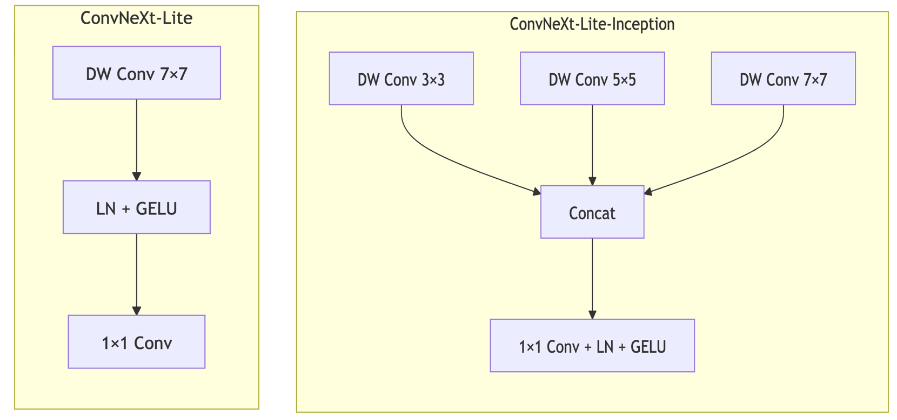
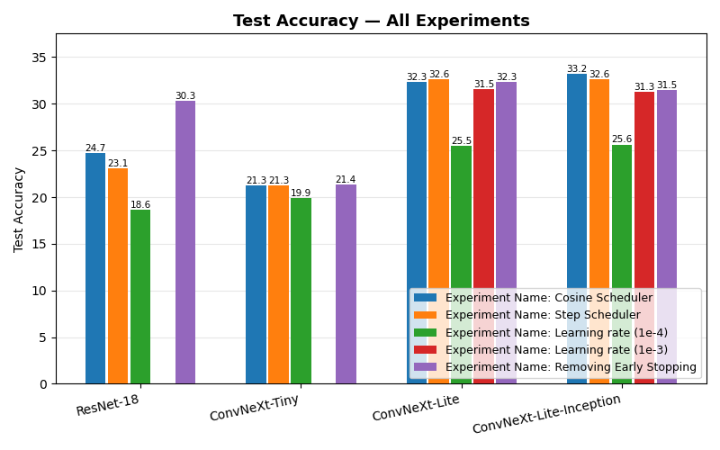

<!-- _class: lead -->

# CS5242 Project
## Image Classification on Mini-ImageNet

**Frozen Features, Fine-Tuning, and From Scratch — a Three-Lens Comparison**

---

# Agenda

1. **Problem, Data & Pre-processing** — Mini-ImageNet, EDA, normalisation choices
2. **Three Approaches** — baseline + proposed improvement
3. **Approach 1** — Classical ML on frozen pretrained features
4. **Approach 2** — Fine-tuning with selective unfreezing
5. **Approach 3** — Training from scratch
6. **Conclusions** — cross-approach synthesis

---

<!-- _class: lead -->

# Part 1
## Problem, Data & Pre-processing

---

<!-- _class: "" -->
<style scoped>
section { font-size: 20px; }
h1 { font-size: 30px; }
</style>

# Problem Statement & Motivation

**Task.** 100-class image classification on **Mini-ImageNet** — small enough to iterate on a single GPU yet rich enough to distinguish modern architectures.

**Why this problem?** Canonical CV task where trade-offs between **architecture**, **data regime**, and **pretraining** can be measured cleanly. Mini-ImageNet stresses **small data** (500/class), **low resolution** (32×32), and the **pretrained-vs-scratch** divide.

**Why deep learning?** 100-way image classification needs hierarchical visual features — CNN/ConvNeXt inductive biases match the input structure; no competitive classical alternative at this scale.

**Why pretrained models — justified.** We use them in **A1 & A2** to quantify how much Mini-ImageNet performance is carried by ImageNet pretraining, and include **A3 (from scratch)** to isolate that contribution. The scientific question is *the value of pretraining*.

---

<!-- _class: "" -->
<style scoped>
section { font-size: 20px; }
h1 { font-size: 30px; }
h3 { font-size: 22px; }
</style>

# Dataset

- **Source:** Mini-ImageNet [4] — 100 classes drawn from ImageNet-1K
- **Splits:** 50,000 train / 10,000 val / 5,000 test (fixed, reproducible)
- **Balance:** 500 train images per class (perfectly balanced — no re-weighting needed)
- **Resolutions tested:** native (≈500×N) resized to **224×224** and **32×32**

<div class="columns">
<div>

### Why 32×32 *and* 224×224?
- **224×224** matches pretraining → upper-bound on pretrained feature quality
- **32×32** stresses architectures *off* design regime — robustness test + practical memory-bandwidth setting

</div>
<div>

### Known Caveat
Mini-ImageNet's 100 classes are a *subset* of ImageNet-1K. Pretrained backbones have seen these classes, so 224×224 pretrained numbers are an **upper bound**, not transfer to an unseen distribution. Approach 3 (from scratch) addresses this directly.

</div>
</div>

---

<!-- _class: "" -->
<style scoped>
section { font-size: 20px; }
h1 { font-size: 30px; }
h3 { font-size: 22px; }
</style>

# Exploratory Data Analysis

<div class="columns">
<div>


### Class distribution
- Exactly balanced across train/val/test — no class imbalance to correct
- Eliminates class-weighting as a confound in later results

### Dataset statistics
- **Train mean (RGB):** `(0.479, 0.452, 0.408)`
- **Train std (RGB):** `(0.288, 0.280, 0.294)`
- Native resolutions cluster near 500×375

</div>
<div>

### Visual sample (random grid)


</div>
</div>

> EDA outputs in [experiments/eda/](../eda/) — full figures from `data_analysis.ipynb`.

---

<!-- _class: "" -->
<style scoped>
section { font-size: 20px; }
h1 { font-size: 30px; }
h3 { font-size: 22px; }
blockquote { font-size: 18px; }
</style>

# Pre-processing Pipeline

<div class="columns">
<div>

### Shared across all approaches
- **Resize** to target (224 or 32) with aspect-preserving centre crop
- **Normalise** with this dataset's own mean/std (from the train split), not ImageNet defaults
- **Channel order** RGB, tensor in `[0,1]` before normalisation
- Split integrity: transforms fit on **train only**; val/test use those stats

</div>
<div>

### Approach-specific
- **A2 & A3 (training):** random crop + horizontal flip augmentation
- **A1 (frozen features):** no train-time augmentation — features extracted once and cached
- **A3 (from scratch):** heavier augmentation may be used — *[team member to specify]*

</div>
</div>

> Computing mean/std *on this dataset* is deliberate: the 32×32 resized distribution's statistics drift from full-resolution ImageNet statistics.

---

<!-- _class: lead -->

# Part 2
## Three Approaches — Baseline & Improvement

---

# The Three-Lens Design

<div class="columns-3">
<div>

### Approach 1 — Classical ML
**Role:** strong baseline using **pretrained** features
- Frozen backbone + linear SVM / LogReg
- Isolates feature quality from classifier choice
- Very cheap, interpretable

</div>
<div>

### Approach 2 — Fine-Tuning
**Role:** **proposed improvement**
- Pretrained init + selective unfreezing
- Combines transfer with task-specific adaptation
- Expected Pareto-best at moderate cost

</div>
<div>

### Approach 3 — Scratch
**Role:** baseline from **first principles**
- Random init, full training
- Same architecture family, no ImageNet prior
- Measures *pure* in-domain signal

</div>
</div>

> **Scientific question:** how much of Mini-ImageNet performance is *feature quality from pretraining* (A1) vs *task-specific adaptation* (A2) vs *learned end-to-end without prior* (A3)?
> Reporting all three lets us attribute performance to each source instead of conflating them.

---

<!-- _class: lead -->

# Part 3
## Approach 1 — Classical ML
### Pretrained Backbones as Frozen Feature Extractors
### <span style="color:#555">(Strong baseline using pretrained features)</span>

---

<!-- _class: "" -->
<style scoped>
section { font-size: 20px; }
h1 { font-size: 30px; }
h3 { font-size: 22px; }
blockquote { font-size: 18px; }
</style>

# Approach 1: Motivation

**Idea:** Use pretrained ImageNet backbones as **frozen feature extractors**, then train lightweight classical classifiers on the extracted features.

<div class="columns">
<div>

### Advantages
- **Data efficient** — only classifier head is learnable
- **Fast** — single forward pass + seconds-to-minutes training
- **Interpretable** — isolates backbone effect

</div>
<div>

### Limitations
- No task-specific feature adaptation
- Resolution sensitivity (pretrained for 224×224)
- Linear classifier ceiling

</div>
</div>

---

# Approach 1: Pipeline

```
Image → [Pretrained Backbone (frozen)] → Global Avg Pool → Feature Vector → [SVM / LogReg] → Class
```

**Pipeline:**
1. Load pretrained ImageNet backbone — freeze all weights
2. Extract feature vectors via forward pass (one-time cost)
3. Train classical classifier on extracted features

**Classifiers (sklearn, default hyperparameters):**
- **Linear SVM** — `LinearSVC`, **squared-hinge** loss + L2, OvR, liblinear coordinate-descent solver
- **Logistic Regression** — multinomial cross-entropy + L2, LBFGS, `max_iter=2000`

> Results are single-seed with default hyperparameters.

---

<!-- _class: "" -->
<style scoped>
section { font-size: 18px; }
h1 { font-size: 28px; }
h3 { font-size: 20px; }
table { font-size: 15px; }
blockquote { font-size: 15px; }
</style>

# Approach 1: Experimental Design

### Backbones (3 architecture families)

| Backbone | Family | Params (backbone, M) | Feature Dim | torchvision weights (IN-1K top-1) |
|---|---|---|---|---|
| ConvNeXt-Tiny | ConvNeXt [2] | 27.9 | 768 | `IMAGENET1K_V1` (82.52%) |
| ResNet-18 | ResNet [1] | 11.2 | 512 | `IMAGENET1K_V1` (69.76%) |
| ResNet-34 | ResNet [1] | 21.3 | 512 | `IMAGENET1K_V1` (73.31%) |
| ResNet-50 | ResNet [1] | 23.7 | 2048 | `IMAGENET1K_V2` (80.86%) |
| EfficientNet-b0 | EfficientNet [3] | 4.1 | 1280 | `IMAGENET1K_V1` (77.69%) |

### Experiment Grid
- **32×32**: All backbones × {SVM, LogReg}
- **224×224**: ConvNeXt-Tiny & ResNet-18 × SVM (downselected)

<div class="footnote">[1] He et al., CVPR 2016 &nbsp; [2] Liu et al., CVPR 2022 &nbsp; [3] Tan & Le, ICML 2019 &nbsp; [4] Vinyals et al., NeurIPS 2016</div>

---

<!-- _class: "" -->
<style scoped>
section { font-size: 20px; }
h1 { font-size: 28px; }
blockquote { font-size: 18px; }
</style>

# Approach 1 — Results: NetScore, Accuracy, Inference & Parameters


> **Key observation:** ConvNeXt-Tiny leads on **accuracy** (44.16%) despite the most parameters, while ResNet-18 leads on **NetScore** (45.4, per Wong [6]) due to its small size and fast inference. EfficientNet-b0 is slowest and least accurate.

---

<!-- _class: "" -->
<style scoped>
section { font-size: 18px; }
table { font-size: 15px; }
h1 { font-size: 30px; }
h3 { font-size: 20px; }
</style>

# Approach 1 — Efficiency Comparison (32×32)

<div class="columns">
<div>

$$\text{NetScore} = 20\,\log_{10}\!\left(\frac{A^2}{\sqrt{T}\,\sqrt{P}}\right)$$

| Backbone | Clf | Acc | Infer | NS |
|---|---|---|---|---|
| ResNet-18 | SVM | 32.52 | **2.89** | **45.4** |
| ResNet-18 | LR | 32.46 | 3.09 | 45.1 |
| ConvNeXt | LR | **44.16** | 5.92 | 43.6 |
| ConvNeXt | SVM | 43.28 | 5.96 | 43.2 |
| ResNet-34 | LR | 33.16 | 5.17 | 40.4 |
| ResNet-34 | SVM | 33.08 | 5.49 | 40.1 |
| EffNet-b0 | LR | 24.72 | 9.66 | 39.7 |
| EffNet-b0 | SVM | 23.88 | 9.51 | 39.2 |
| ResNet-50 | LR | 33.22 | 6.47 | 39.0 |
| ResNet-50 | SVM | 27.34 | 6.51 | 35.6 |

</div>
<div>

### Key Observations

- **ResNet-18 SVM tops NetScore** (45.4) — smallest model (11.2M) + fastest inference (2.89 ms) offsets lower accuracy

- **ConvNeXt-Tiny LogReg** leads on raw accuracy (44.16%) but 27.9M params penalise its NetScore

- **Classifier choice barely affects NetScore** — SVM vs LogReg differ by <0.5 for same backbone, since inference time is backbone-dominated

- **EfficientNet-b0** has poor NetScore despite fewest params (4.1M) — slowest inference (9.5 ms) + lowest accuracy (24%)

</div>
</div>

---

# Why ConvNeXt-Tiny Dominates at 32×32

The key lies in how each architecture's **stem** processes low-resolution input:

<div class="columns">
<div>

### ConvNeXt-Tiny Stem
- **4×4 stride-4 patchify** convolution
- 32×32 input → **8×8 feature map** after stem
- Subsequent **7×7 depthwise kernels** still have meaningful spatial extent to work with
- LayerNorm stabilises activations; GELU preserves gradient flow

</div>
<div>

### ResNet Stem
- **7×7 stride-2** conv + **3×3 stride-2** max-pool
- 32×32 input → **8×8** after stem, then quickly **1×1** through residual stages
- Deeper layers receive **spatially degenerate** feature maps — no local structure to exploit
- BatchNorm statistics are calibrated for 224×224 distributions

</div>
</div>

> ConvNeXt's patchify stem is resolution-adaptive: it reduces spatial dims in one step without the cascading downsampling that collapses small inputs in ResNets.

---

<!-- _class: "" -->
<style scoped>
section { font-size: 20px; }
h1 { font-size: 28px; }
</style>

# Why Architecture Matters More Than Depth


- **ResNet-18/34/50 cluster within ~1% on LogReg** (32.46 / 33.16 / 33.22) → extra depth gives no headroom at 32×32
- **ConvNeXt-Tiny** leads by 10+% — patchify stem + 7×7 DW-Conv preserve spatial structure
- **EfficientNet-b0 underperforms** — designed for 224×224; at 32×32 its feature maps are too small for Squeeze-and-Excitation (SE) attention and depthwise convolutions to be effective
- *Caveat:* RN-50 uses torchvision `V2` weights; the "depth doesn't help" claim holds for LogReg but SVM+RN-50 is an outlier

---

# Generalisation Gap


> Val−Test gap is uniformly small (0.6–3.0%) — linear models on frozen features generalise well.

---

<!-- _class: "" -->
<style scoped>
section { font-size: 16px; }
h1 { font-size: 24px; }
blockquote { font-size: 13px; }
</style>

# Resolution Impact & t-SNE Feature Visualisation

<div class="columns">
<div>


- Both backbones lose ≈**50%** (224→32) — severe resolution floor
- ConvNeXt-Tiny's ~10% advantage preserved at both resolutions

</div>
<div>


- **224×224:** Tight, well-separated clusters — high linear-probe accuracy
- **32×32:** Clusters collapse — consistent with ~50% drop
- ConvNeXt-Tiny retains more inter-class separation at both resolutions

</div>
</div>

---

# Backbone Downselection for Later Approaches

Based on these results, we select **two backbones** for Approaches 2 and 3:

<div class="columns">
<div>

### 1. ConvNeXt-Tiny (SOTA)
- **Highest accuracy** at all resolutions
- 93.88% (224×224), 44.16% (32×32)
- Modern architecture innovations
- Best candidate for further improvement

</div>
<div>

### 2. ResNet-18 (Classical Baseline)
- **Fastest inference** (2.9 ms/image)
- Well-established architecture
- Measures how much fine-tuning closes the gap
- Simple & interpretable

</div>
</div>

> This pairing lets us compare fine-tuning and from-scratch strategies on a **modern vs classical** architecture.

---

<!-- _class: "" -->
<style scoped>
section { font-size: 19px; }
h1 { font-size: 28px; }
ol { margin-top: 0.4em; }
ol li { margin-bottom: 0.4em; }
</style>

# Approach 1 — Key Takeaways

1. **ConvNeXt-Tiny is the strongest backbone** — leads by 10+% at both resolutions on Mini-ImageNet
2. **Architecture matters more than depth** — RN-18/34/50 cluster within ~1%; ConvNeXt's stem design is the larger effect
3. **Resolution is the dominant factor** — 224→32 costs ≈50% for both probed backbones; larger than any architecture gap
4. **EfficientNet-b0 underperforms at 32×32** — designed for 224×224; feature maps too small for SE attention and depthwise convolutions
5. **Small val–test gap (0.6–3.0%)** — linear probes on frozen features generalise well
6. **Limitations.** Single seed, default hyperparameters, Mini-ImageNet ⊂ ImageNet-1K, mixed `V1`/`V2` torchvision weights

---

<!-- _class: lead -->

# Part 4
## Approach 2 — Fine-Tuning

---

<!-- _class: "" -->
<style scoped>
section { font-size: 20px; }
h1 { font-size: 30px; }
h3 { font-size: 22px; }
blockquote { font-size: 18px; }
</style>

# Approach 2: Motivation & Setup

**Idea:** Start from ImageNet-pretrained ConvNeXt-Tiny and ResNet-18, then adapt the classifier, the deepest stage, the full model, or low-rank adapter paths to Mini-ImageNet.

<div class="columns">
<div>

### Why this improves Approach 1
- Approach 1 freezes the representation and only learns a linear boundary
- Fine-tuning lets high-level features reorganise around Mini-ImageNet's 100 classes
- Tests whether ConvNeXt's frozen-feature advantage survives task adaptation

</div>
<div>

### Shared protocol
- **Input:** 32×32 Mini-ImageNet
- **Backbones:** ConvNeXt-Tiny, ResNet-18
- **Runs:** `USE_AUG=False`, `mix_mode=none`
- **Optimiser:** AdamW [8], LR = `1e-4`
- **Schedule:** cosine annealing [9] + early stopping

</div>
</div>

> Fine-tuning asks: how much can we recover from the 32×32 resolution floor once the backbone is allowed to adapt?

---

<!-- _class: "" -->
<style scoped>
section { font-size: 18px; }
h1 { font-size: 28px; }
h3 { font-size: 20px; }
table { font-size: 14px; }
blockquote { font-size: 16px; }
</style>

# Approach 2: Four Adaptation Policies

| Policy | What is trainable? | Patience | ConvNeXt trainable | ResNet trainable |
|---|---|---:|---:|---:|
| Classifier only (`backbone`) | final classifier head only | 3 | 0.078M | 0.051M |
| Last stage + classifier | deepest feature stage + classifier | 7 | 15.549M | 8.445M |
| Full fine-tuning (`none`) | all pretrained weights + classifier | 7 | 27.897M | 11.228M |
| LoRA [10] | Linear-layer adapters + classifier; base weights frozen | 5 | 0.608M | 0.056M |

### Why these policies?

- **Classifier only** is the transfer-learning analogue of the Approach 1 frozen-feature baseline, but with a neural head
- **Last stage** targets class-specific semantic features while preserving generic early filters
- **Full fine-tuning** gives maximum adaptation capacity
- **LoRA** tests parameter-efficient adaptation on eligible `Linear` layers only, with rank = 8 and alpha = 16

> These policies move from cheapest and most constrained to most flexible, letting us separate classifier learning from representation adaptation.

---

<!-- _class: "" -->
<style scoped>
section { font-size: 20px; }
h1 { font-size: 28px; }
h3 { font-size: 21px; }
blockquote { font-size: 18px; }
</style>

# LoRA: Low-Rank Adaptation

LoRA is applied only to eligible backbone `Linear` layers in our implementation; convolutional layers are not LoRA-adapted.

$$W' = W_{frozen} + B A \frac{\alpha}{r}$$

<div class="columns">
<div>

### What is trained?
- LoRA matrices `A` and `B` in targeted `Linear` layers
- Final classifier head
- Original backbone weights remain frozen
- Rank `r = 8`, scaling `alpha = 16`

</div>
<div>

### Why it matters here
- ConvNeXt has many internal `Linear` layers, so LoRA can adapt useful representation paths
- ResNet-18 is mostly convolutional, so Linear-layer LoRA has less room to help
- Explains the architecture-specific LoRA result: **61.74%** for ConvNeXt vs **19.64%** for ResNet-18

</div>
</div>

> LoRA is parameter-efficient, but its benefit depends on whether the backbone exposes useful `Linear` layers for low-rank updates.

---

<!-- _class: "" -->
<style scoped>
section { font-size: 18px; }
h1 { font-size: 28px; }
h3 { font-size: 20px; }
li { font-size: 16px; }
blockquote { font-size: 16px; }
</style>

# AdamW Optimizer

All transfer-learning runs use AdamW [8], an Adam-style optimizer with decoupled weight decay:

$$m_t = \beta_1 m_{t-1} + (1-\beta_1)g_t,\quad v_t = \beta_2 v_{t-1} + (1-\beta_2)g_t^2$$

$$\theta_t = \theta_{t-1} - \eta\frac{\hat{m}_t}{\sqrt{\hat{v}_t}+\epsilon} - \eta\lambda\theta_{t-1}$$

<div class="columns">
<div>

### Why AdamW?
- Adaptive step size for each parameter
- Weight decay is applied separately from gradient moments
- Stable for fine-tuning pretrained ConvNeXt and ResNet at LR = `1e-4`

</div>
<div>

### Parameters
- `g_t`: gradient at step `t`
- `m_t`: moving average of gradients; `beta_1` controls momentum
- `v_t`: moving average of squared gradients; `beta_2` controls gradient scale memory
- `eta`: learning rate, `lambda`: weight decay, `epsilon`: stability constant

</div>
</div>

> Compared with SGD, AdamW is less sensitive to one global learning rate and handles layers with different gradient scales better.

---

<!-- _class: "" -->
<style scoped>
section { font-size: 20px; }
h1 { font-size: 28px; }
h3 { font-size: 21px; }
blockquote { font-size: 18px; }
</style>

# Cosine Annealing Scheduler

All fine-tuning runs use AdamW with a cosine learning-rate schedule:

$$\eta_t = \eta_{min} + \frac{1}{2}(\eta_{max} - \eta_{min})\left(1 + \cos\left(\frac{t}{T_{max}}\pi\right)\right)$$

<div class="columns">
<div>

### Why use it?
- Larger updates early help the model move toward Mini-ImageNet-specific features
- Smaller updates later avoid disrupting useful pretrained representations
- Smooth decay is better suited to fine-tuning than abrupt LR drops

</div>
<div>

### In our setup
- Initial LR: `1e-4`
- Schedule length: full epoch budget
- Checkpoint selection: best validation accuracy
- Early stopping prevents wasting epochs after validation saturation

</div>
</div>

> Cosine annealing gives adaptation room early, then stabilises the pretrained backbone as training converges.

---

<!-- _class: "" -->
<style scoped>
section { font-size: 17px; }
h1 { font-size: 28px; }
h3 { font-size: 20px; }
table { font-size: 13px; }
blockquote { font-size: 16px; }
</style>

# Approach 2 — Accuracy Results

| Backbone | Method | Best val | Test acc | Test loss | Epochs |
|---|---|---:|---:|---:|---:|
| ConvNeXt-Tiny | Classifier only | 52.40 | 50.92 | 1.9369 | 54 |
| ConvNeXt-Tiny | Last stage + classifier | 57.26 | 55.44 | 1.7156 | 16 |
| ConvNeXt-Tiny | **Full fine-tuning** | **65.11** | **62.70** | 1.6357 | 16 |
| ConvNeXt-Tiny | LoRA | 64.26 | 61.74 | **1.4397** | 34 |
| ResNet-18 | Classifier only | 21.49 | 19.98 | 3.5373 | 36 |
| ResNet-18 | Last stage + classifier | 33.18 | 32.64 | 2.8840 | 18 |
| ResNet-18 | **Full fine-tuning** | **40.41** | **39.34** | **2.5783** | 15 |
| ResNet-18 | LoRA | 21.48 | 19.64 | 3.5176 | 40 |

> Full fine-tuning is best for both backbones; ConvNeXt-Tiny LoRA is almost as accurate and has the lowest ConvNeXt test loss.

---

<!-- _class: "" -->
<style scoped>
section { font-size: 19px; }
h1 { font-size: 28px; }
h3 { font-size: 21px; }
blockquote { font-size: 18px; }
</style>

# Approach 2 — What the Results Say

<div class="columns">
<div>

### ConvNeXt-Tiny
- Classifier only already improves over the Approach 1 frozen LogReg baseline: **50.92% vs 44.16%**
- Last-stage fine-tuning adds another **+4.52%**
- Full fine-tuning reaches **62.70%**, the strongest result
- LoRA reaches **61.74%**, only **0.96%** behind full tuning

</div>
<div>

### ResNet-18
- Classifier-only transfer is weak: **19.98%**, below the Approach 1 frozen-feature probes
- Last-stage tuning recovers to **32.64%**
- Full fine-tuning reaches **39.34%**, best ResNet result
- LoRA stays near classifier-only because adapters only target `Linear` layers

</div>
</div>

> ConvNeXt-Tiny benefits from both full fine-tuning and LoRA because its ConvNeXt blocks contain many internal Linear layers; ResNet-18 needs broader convolutional adaptation.

---

<!-- _class: "" -->
<style scoped>
section { font-size: 17px; }
h1 { font-size: 28px; }
h3 { font-size: 20px; }
table { font-size: 15px; }
blockquote { font-size: 16px; }
</style>

# Approach 2 — Efficiency & NetScore

| Backbone | Method | Test | Infer | Params | Train time | Peak mem | NetScore |
|---|---|---:|---:|---:|---:|---:|---:|
| ConvNeXt | **Full fine-tuning** | **62.70** | 6.01 | 27.90M | 1950s | 1458MB | **49.65** |
| ConvNeXt | Last stage | 55.44 | 5.90 | 27.90M | **1872s** | 437MB | 47.59 |
| ConvNeXt | LoRA | 61.74 | 10.58 | 28.43M | 3986s | 1126MB | 46.84 |
| ConvNeXt | Classifier only | 50.92 | 6.04 | 27.90M | 6237s | **260MB** | 46.01 |
| ResNet-18 | **Full fine-tuning** | **39.34** | 2.99 | 11.23M | **1773s** | 513MB | **48.53** |
| ResNet-18 | Last stage | 32.64 | 2.89 | 11.23M | 2116s | 284MB | 45.44 |
| ResNet-18 | Classifier only | 19.98 | **2.80** | 11.23M | 4154s | 187MB | 37.05 |
| ResNet-18 | LoRA | 19.64 | 2.94 | 11.23M | 4569s | **187MB** | 36.54 |

> Full fine-tuning wins NetScore for both backbones because the accuracy gain outweighs the inference-time and parameter terms in the metric.

---

<!-- _class: "" -->
<style scoped>
section { font-size: 19px; }
h1 { font-size: 28px; }
h3 { font-size: 21px; }
blockquote { font-size: 18px; }
</style>

# Approach 2 — Transfer Learning Takeaways

<div class="columns">
<div>

### Main ranking
1. **ConvNeXt full fine-tuning:** 62.70%
2. **ConvNeXt LoRA:** 61.74%
3. **ConvNeXt last-stage:** 55.44%
4. **ConvNeXt classifier-only:** 50.92%

</div>
<div>

### Cross-backbone lesson
- ConvNeXt-Tiny beats ResNet-18 under every transfer policy
- Full tuning improves both architectures most reliably
- LoRA is architecture-dependent: strong on ConvNeXt, weak on ResNet-18
- More trainable capacity improves accuracy, but raises overfitting and memory risk

</div>
</div>

> The proposed improvement is supported: task-specific adaptation raises the best 32×32 result from **44.16%** frozen features to **62.70%** full fine-tuning.

---


<!-- _class: lead -->

# Part 5
## Approach 3 — Training from Scratch
### Evaluating Pure Architectural Efficiency

---

<!-- _class: "" -->
<style scoped>
section { font-size: 20px; }
h1 { font-size: 30px; }
h3 { font-size: 22px; }
blockquote { font-size: 18px; }
</style>

# Motivation & Evaluation Setting

**Why train from scratch?**

- Transfer learning can mask intrinsic architectural properties
- Realistic scenario for:
  - Domain-specific datasets
  - Limited compute / no large-scale pretraining
  - Resource-constrained deployment

**Goal:**  
Isolate the **pure efficiency–effectiveness trade-off** of architectures *without ImageNet priors*.

> Training from scratch is a **stress test** for architectural inductive bias, optimization stability, and parameter efficiency.

---

<!-- _class: "" -->
<style scoped>
section { font-size: 20px; }
h1 { font-size: 30px; }
h3 { font-size: 22px; }
</style>

# Architectures Compared

| Model | Params (M) | Design Intent |
|---|---:|---|
| **ResNet-18** | 11.2 | Strong inductive bias, stable optimization |
| **ConvNeXt-Tiny** | 27.9 | High capacity, pretraining-oriented |
| **ConvNeXt-Lite (ours)** | **3.6** | Lightweight, efficiency-first |
| **ConvNeXt-Lite-Inception (ours)** | **5.0** | Multi-scale enhancement |

**Key design choices (ours):**
- Reduced depth & channel width
- Depthwise convolutions + LayerNorm + GELU
- Optional **Inception-style multi-scale depthwise kernels (3×3, 5×5, 7×7)**

> Hypothesis: **Careful inductive bias beats raw capacity** in from-scratch regimes.


---
<!-- _class: "" -->
<style scoped>
section { font-size: 20px; }
h1 { font-size: 30px; }
figure { text-align: center; }
figcaption {
  font-size: 16px;
  color: #555;
  margin-top: 0.5em;
}
</style>

# Proposed Architectures

<figure>
 <figcaption>
    Side-by-side comparison of <b>ConvNeXt-Lite</b> (left) and
    <b>ConvNeXt-Lite-Inception</b> (right).  
    The Inception variant introduces multi-scale depthwise convolutions
    (3×3, 5×5, 7×7) while preserving the lightweight ConvNeXt design.
  </figcaption>
  
</figure>


> Idea: ConvNeXt‑Lite prioritizes efficiency through aggressive simplification, while the Inception variant re‑injects spatial diversity via multi‑scale depthwise kernels at minimal cost

---
<!-- _class: "" -->
<style scoped>
section { font-size: 20px; }
h1 { font-size: 30px; }
figure { text-align: center; }
figcaption {
  font-size: 16px;
  color: #555;
  margin-top: 0.6em;
  line-height: 1.4;
}
</style>

# Approach 3 — Experimental Overview

<figure>
  <figcaption>
    Test accuracy across all <b>from‑scratch experiments</b> under different optimization settings.
    ConvNeXt‑Lite and ConvNeXt‑Lite‑Inception consistently outperform ResNet‑18 and ConvNeXt‑Tiny
    across schedulers and learning rates, demonstrating superior optimization robustness and
    efficiency‑aware generalization.
  </figcaption>
  
</figure>

This figure shows all from‑scratch experiments.
The key pattern is that ConvNeXt‑Lite variants are consistently strong across schedulers and learning rates, while ConvNeXt‑Tiny struggles to optimize without pretraining.

---

<!-- _class: "" -->
<style scoped>
section { font-size: 18px; }
h1 { font-size: 28px; }
table { font-size: 15px; }
blockquote { font-size: 16px; }
</style>

# Results: Accuracy vs Efficiency (32×32)

| Model | Params (M) | Test Acc (%) | Infer (ms) | NetScore |
|---|---:|---:|---:|---:|
| ResNet-18 | 11.23 | 24.74 | **2.99** | 40.48 |
| ConvNeXt-Tiny | 27.90 | 21.30 | 6.01 | 30.89 |
| **ConvNeXt-Lite** | **3.56** | **32.32** | **2.98** | **50.12** |
| ConvNeXt-Lite-Inception | 4.98 | **33.20** | 3.15 | 48.89 |

**Observations**
- ConvNeXt-Tiny **fails to scale down** when trained from scratch
- ConvNeXt-Lite achieves **+7–10% accuracy** over ResNet-18 with **~⅓ parameters**
- Inception variant improves peak accuracy with minimal overhead

---

<!-- _class: "" -->
<style scoped>
section { font-size: 20px; }
h1 { font-size: 28px; }
h3 { font-size: 22px; }
blockquote { font-size: 18px; }
</style>

# Key Insights & Implications

### What we learn
1. **Larger ≠ better** without pretraining  
   ConvNeXt-Tiny underperforms despite highest capacity
2. **Inductive bias > parameter count**  
   Lightweight ConvNeXt-style design generalizes better
3. **Multi-scale features help**  
   Inception-style depthwise kernels recover lost capacity
4. **Optimization robustness matters**  
   Proposed models are stable across schedulers and learning rates

> **Conclusion:**  
A carefully designed lightweight architecture can achieve a **superior efficiency–effectiveness trade-off** compared to both classical ResNets and large modern ConvNets when trained entirely from scratch.

---

<!-- _class: lead -->

# Part 6
## Conclusions
### Accuracy vs Efficiency Across Approaches

---

<!-- _class: "" -->
<style scoped>
section { font-size: 20px; }
h1 { font-size: 30px; }
h3 { font-size: 22px; }
table { font-size: 16px; }
blockquote { font-size: 18px; }
</style>

# Cross‑Approach Comparison

| Method | Backbone | Test Acc (%) | Infer (ms/img) | Params (M) | NetScore |
|---|---|---:|---:|---:|---:|
| A1 — Frozen Features | ResNet‑18 | 32.52 | **2.89** | 11.23 | 45.37 |
| A1 — Frozen Features | ConvNeXt‑Tiny | 43.28 | 5.96 | 27.90 | 43.24 |
| A2 — Full Fine‑Tuning | ResNet‑18 | 39.34 | 2.99 | 11.23 | 48.53 |
| A2 — Full Fine‑Tuning | ConvNeXt‑Tiny | **62.70** | 6.01 | 27.90 | 49.65 |
| **A3 — From Scratch** | **ConvNeXt‑Lite** | 32.32 | 2.98 | **3.56** | **50.12** |
| A3 — From Scratch | ConvNeXt‑Lite‑Inception | 33.20 | 3.15 | 4.98 | 48.89 |

### Accuracy‑centric view
- **Approach 2 (Transfer Learning)** dominates accuracy  
  → ConvNeXt‑Tiny full fine‑tuning reaches **62.70%**
- **Approach 1 ≈ Approach 3** in accuracy  
  → Lightweight from‑scratch models match frozen ResNet‑18 **without pretraining**
- Indicates **inductive bias can partially substitute for pretrained features**

> Accuracy ranking:  
> **Approach 2 > Approach 1 ≈ Approach 3**

---
<!-- _class: "" -->
<style scoped>
section { font-size: 18px; }
h1 { font-size: 30px; }
h3 { font-size: 22px; }
blockquote { font-size: 16px; }
</style>

# Efficiency, NetScore & Interpretation

### NetScore reshapes the ranking
- **Approach 3 achieves the highest NetScore**
  - ConvNeXt‑Lite: **50.12** with only **3.56M params**
  - Fast inference (**2.98 ms/img**) offsets lower absolute accuracy
- **Approach 2** improves accuracy but pays for it with:
  - Larger backbones (27.9M params)
  - Higher latency (~6 ms/img)
  → NetScore gains are **moderate**, not dominant
- **Approach 1** is efficient and stable but capped by frozen representations

### Key interpretation
- **Higher accuracy ≠ better overall performance**
- Optimal strategy depends on deployment constraints:
  - Accuracy‑first → **Transfer learning**
  - Simplicity & stability → **Frozen features**
  - Balanced efficiency–effectiveness → **Lightweight from‑scratch design**

> **Takeaway:**  
> There is no universally optimal approach.  
> **Architectural design aligned with constraints matters more than raw accuracy alone.**

--
# Conclusions

---

<!-- _class: "" -->
<style scoped>
section { font-size: 15px; }
h1 { font-size: 28px; }
p { margin: 0.3em 0; }
</style>

# References

[1] K. He, X. Zhang, S. Ren, and J. Sun, "Deep residual learning for image recognition," in *Proc. IEEE CVPR*, 2016, pp. 770–778.

[2] Z. Liu, H. Mao, C.-Y. Wu, C. Feichtenhofer, T. Darrell, and S. Xie, "A ConvNet for the 2020s," in *Proc. IEEE/CVF CVPR*, 2022, pp. 11976–11986.

[3] M. Tan and Q. V. Le, "EfficientNet: Rethinking model scaling for convolutional neural networks," in *Proc. ICML*, 2019, pp. 6105–6114.

[4] O. Vinyals, C. Blundell, T. Lillicrap, K. Kavukcuoglu, and D. Wierstra, "Matching networks for one-shot learning," in *Proc. NeurIPS*, 2016.

[5] W. Luo, Y. Li, R. Urtasun, and R. Zemel, "Understanding the effective receptive field in deep convolutional neural networks," in *Proc. NeurIPS*, 2016.

[6] A. Wong, "NetScore: Towards universal metrics for large-scale performance analysis of deep neural networks," in *Proc. Int. Conf. Image Analysis and Recognition (ICIAR)*, 2019.

[7] R.-E. Fan, K.-W. Chang, C.-J. Hsieh, X.-R. Wang, and C.-J. Lin, "LIBLINEAR: A library for large linear classification," *JMLR*, vol. 9, pp. 1871–1874, 2008.

[8] I. Loshchilov and F. Hutter, "Decoupled weight decay regularization," in *Proc. ICLR*, 2019.

[9] I. Loshchilov and F. Hutter, "SGDR: Stochastic gradient descent with warm restarts," in *Proc. ICLR*, 2017.

[10] E. J. Hu et al., "LoRA: Low-rank adaptation of large language models," in *Proc. ICLR*, 2022.

---

<!-- _class: lead -->

# Thank You
